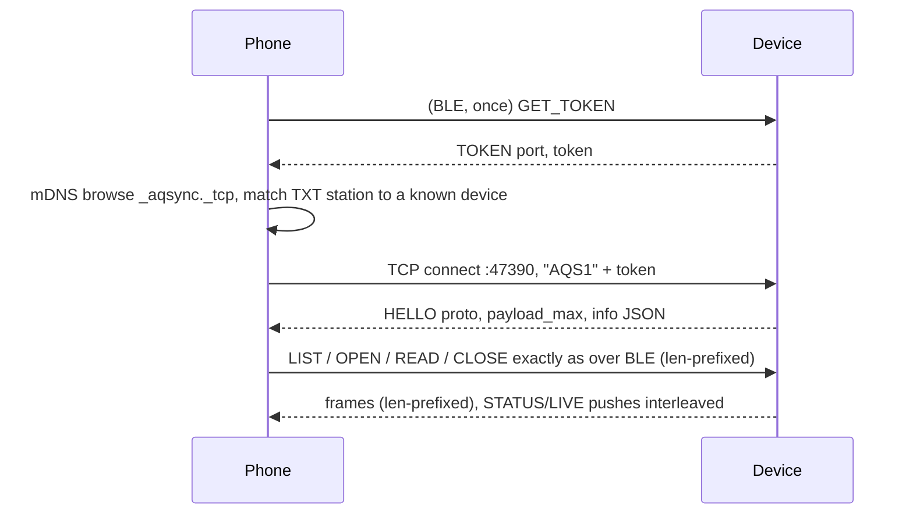

# Sync protocol: device ↔ phone over BLE and LAN


> **Board scope:** AQCommon, AQRuntime, AQConnectivity and AQLogger implement this shared contract for the CoreS3 and Waveshare V2 logger adapters. `info` identifies the board-owned schema, dictionary and firmware; a `cores3-*` identity or CoreS3 measurement must not be relabeled as Waveshare evidence. The retained Waveshare UART/TF diagnostic does not start these services.

Load when implementing or debugging BLE, the local Wi-Fi/TCP server, or a phone
client. Protocol version **2** was defined 2026-09-17; version 1 (BLE file sync)
is a strict subset. Revision **2.1** (2026-09-18, CoreS3 firmware `-v6.3`) adds
[advertising](#advertising-payload-v21) and moves the UUID list to the scan
response. The 2026-09-28 AQLogger integration raises STATUS/LIVE JSON capacity
from 240 to 480 bytes and adds board-specific optional LIVE fields; UUIDs,
request opcodes and `info.proto=2` remain unchanged. Clients must handle the
larger cached values as described below. Hardware evidence and limits belong to
the [CoreS3 bench](../boards/m5stack-cores3/bench-verified.md) and
[Waveshare bench](../boards/waveshare-esp32-s3-sim7670g/bench-verified.md).
CoreS3-specific radio constraints remain in its
[wireless note](../boards/m5stack-cores3/cores3-wireless.md); the shared row/file
contract is in [telemetry-pipeline](telemetry-pipeline.md).
The 2026-09-30 Waveshare v2 addition extends authenticated CONFIG with sensor
identity and an opt-in batch candidate; it keeps `info.proto=2` and raw LIVE
values unchanged. This addition has host/build evidence only, pending a board
flash and readback.

Version 2 adds, on top of the v1 file sync: **device configuration and control** (`GET_CONFIG`/`SET_CONFIG`, Wi-Fi scan and provisioning, reboot, log tail), **pairing modes** for devices without a screen, and a **LAN transport** — the same frames over one TCP socket, discovered with mDNS, authenticated with a token the phone can only obtain over the bonded BLE link. BLE introduces, LAN accelerates. Revision 2.1 adds a way for the device to tell a phone that is *not* connected that something changed; why and how a phone uses it is in [background-sync-triggers](background-sync-triggers.md).

## Purpose and non-goals

The system is **offline-first**: the card is the data origin, and a local archive on a phone, laptop or hub is its first copy. Logging and local sync work with no internet. Any link between device and phone — BLE today, Wi-Fi or LoRa device-to-device later — is a sync transport, and if the device or the phone happens to have Wi-Fi or a SIM, that is welcome but never required. Cloud upload, when it exists, is a separate opt-in step that runs *after* local sync and is off by default. This document covers the BLE transport. A phone within Bluetooth range must be able to, without internet or any server:

1. identify the device and its schema,
2. watch the latest readings,
3. give the device UTC once per boot,
4. list every finalized Parquet file on the microSD,
5. copy those files, byte-exact and verified, into the phone's own storage.

The device **never** deletes, rewrites or renames a finalized file because of the phone. Sync is a pull of immutable files; deduplication happens on the phone. There is no SQL, no query pushdown, no row-level API. The phone holds whole files, exactly as the USB-serial `parquet list` / `parquet get` path delivers them today (`tools/export_parquet.py`).

## Transport summary

| Item | Value |
| --- | --- |
| Role | Device = GATT server / peripheral. Phone = central. One connection at a time. |
| Advertising | Connectable, legacy PDUs, public address (the ESP32-S3 factory MAC, the same bytes `device_id` is built from — never a resolvable private address, see [address stability](#advertising-payload-v21)). **ADV**: flags + 10-byte [service data](#advertising-payload-v21) under the service UUID (31 bytes exactly). **Scan response**: complete local name `AQ-xxxx` (`xxxx` = last four hex digits of `device_id`) + complete 128-bit service UUID list. Before 2.1 the UUID list was in the ADV and there was no service data; Android, CoreBluetooth and bleak all merge both PDUs into one record, so a UUID filter finds the device either way. |
| MTU | Device accepts up to 517. Phone MUST request ≥ 247 before using `control`; request 517 where supported. MTU ≥ 483 carries the maximum 480-byte STATUS/LIVE JSON in one notification. When an actual JSON value exceeds MTU − 3, its notification is omitted; use characteristic long reads for the complete cached snapshot. Frame sizes derive from the negotiated MTU: `payload_max = min(MTU − 3, 512)`. The 512 cap is the GATT attribute-value limit; Android silently drops notifications above it (measured 2026-09-17), macOS does not, so a device that sends 514-byte frames works from a laptop and fails from a phone. |
| Security | LE Secure Connections, bonding. Pairing mode is configurable (below); the default is chosen at first boot from whether a display is present, the way Meshtastic does it. In `random` and `fixed` modes every characteristic requires an encrypted **and authenticated** link (MITM); in `none` mode encrypted only. After the first bond, reconnects are silent. Unbonding is done on the phone, or with `ble.clear_bonds`; the device keeps up to 3 bonds and evicts the oldest. |
| Endianness | Every multi-byte integer is **little-endian**. |
| Text | UTF-8, no terminator, length implied by frame length. JSON where stated, ASCII-only keys. |

### Pairing modes

| `ble.pair` | Passkey | Default when | Notes |
| --- | --- | --- | --- |
| `random` | fresh 6 digits per attempt, shown on the display and printed on serial (`BLE PAIR passkey=`) | a display is detected at first boot | Physical ownership is proven by reading the screen. This is the v1 behaviour and stays the CoreS3 default. |
| `fixed` | `ble.pin`, random **per-device** 6-digit value at first boot | no display is detected at first boot (bare ESP32-S3 PCB) | Same phone UX (Android asks for six digits). The owner obtains it with physical serial `parquet owner-pin` (or an attached pairing display), or configures another value before deployment. This owner reply is excluded from LOG_TAIL and is not printed at boot. Firmware does not ship a universal PIN. Existing installations that still stored legacy `123456` rotate it once at boot. |
| `none` | Just Works | never by default | Encrypted, unauthenticated, no prompt. For lab benches only; must be enabled deliberately. Characteristics drop the `AUTHEN` requirement in this mode so reads succeed. |

The mode and PIN are stored in NVS (`aqcfg` namespace) and are **applied at the next boot**, because the NimBLE security parameters are fixed at stack start; `SET_CONFIG` answers with `reboot_required` set and the phone offers `REBOOT`. The first-boot auto-detection result is stored, so removing the display later does not silently change the mode (again like Meshtastic — change the mode before removing the screen). A lost phone is handled by re-pairing or by `ble.clear_bonds=1`.

The pinned NimBLE 2.5.1 server supplies both pairing modes through
`onPassKeyDisplay`: fixed mode returns the stored per-device PIN and logs only
`passkey=fixed`; random mode generates its per-attempt value. Do not install a
nondefault static `setSecurityPasskey`, which bypasses this callback and its
pairing/UI state. The stack's default value acts only as a callback sentinel.

### Advertising payload (v2.1)

Service data AD (type `0x21`) under the service UUID `c0a5e9f0-0001-…`, in the ADV PDU, refreshed in place (one HCI command) whenever a field changes — at most once per sample tick, in practice a few times per file window. A phone never has to connect to learn any of it, and a phone's offloaded scan filter (`deviceAddress` **and** `serviceData` with a mask on byte 1) can wake its app on a bit flip while it sleeps. Everything here is public to anyone in range: presence, counters, health bits — nothing more.

| Offset | Field | Meaning |
| --- | --- | --- |
| 0 | `ver` u8 | payload version, **1**; a phone ignores payloads with another version |
| 1 | `flags` u8 | bit 0 `no_utc` — no UTC anchor this boot (`status.utc == 0`): rows are landing in the `unsynced` tree, a phone in range should send `SET_TIME` now · bit 1 `new_files` — a file finalized since the last `LIST` answered on any link · bit 2 `sd` (`status.sd`) · bit 3 `lan` — Wi-Fi connected and the mDNS/TCP server up, so a woken phone knows whether the LAN browse is worth its 10 s · bit 4 `fail` (`status.fail`) · bit 5 `clk_restored` — `status.clk == 2`, dated from the RTC only, a time refresh is welcome but not urgent · bits 6–7 reserved, 0 |
| 2–5 | `fin` u32 | `status.fin`, files finalized this boot |
| 6–7 | `boot16` u16 | the last four hex digits of `info.boot`, so a phone notices a reboot (`fin` restarts at 0) |
| 8–9 | reserved | 0. **Never an IP address or port**: advertisements are unauthenticated, and a forged one would send the phone's LAN token to an attacker's socket. Discovery stays mDNS |

Rules: `new_files` is set when a window closes or a `FLUSH` finalizes a file and cleared when a `LIST` has been answered on any link (that phone now knows the file exists; a phone that then fails its download is covered by its own periodic run). `no_utc` and `clk_restored` are mutually exclusive; both clear after a host `SET_TIME`. The interval stays NimBLE's default fast connectable interval (30–60 ms), which sets a low-power scanner's detection latency; if it is ever slowed, keep it ≤ 200 ms for a minute after a flag flips. `pixi run ble-sync scan` prints the decoded payload (`adv_ver= flags= fin= boot16=`).

**Address stability.** Both the Android Companion Device Manager and per-device scan filters key on the advertised address. NimBLE uses the public address derived from the factory MAC; do not enable NimBLE privacy / resolvable private addresses on this device — every presence mechanism would silently stop matching.

## Service and characteristics

Base UUID `c0a5e9f0-XXXX-4b1a-9c3e-2d7f8a6b4e01`; the 16-bit field selects the attribute.

| Attribute | UUID | Props | Payload |
| --- | --- | --- | --- |
| **Service** AQ Sync | `c0a5e9f0-0001-4b1a-9c3e-2d7f8a6b4e01` | — | — |
| `info` | `…-0002-…` | read | JSON, ≤ 400 bytes, static for a boot |
| `status` | `…-0003-…` | read, notify | JSON, ≤ 480 bytes |
| `live` | `…-0004-…` | read, notify | JSON, ≤ 480 bytes |
| `control` | `…-0005-…` | write (with response) | binary request, ≤ 512 bytes |
| `response` | `…-0006-…` | notify | binary frames, ≤ `payload_max` (≤ 512) |

`status` and `live` are ≤ 480 bytes; their characteristic capacities are 496 bytes and the BLE frame cap remains 512 bytes. MTU ≥ 483 is required to carry the largest JSON snapshot in one notification. Each publisher caches the complete JSON value first, then omits its notification when the actual value exceeds negotiated MTU − 3. No partial JSON notification is sent. Clients with smaller MTUs must perform characteristic long reads for complete snapshots; STATUS may update its cache without emitting a notification. `info` may also exceed one PDU and uses a normal long read. All `response` traffic for one request is emitted in order on the single `response` characteristic. CONFIG replies that exceed the ATT payload use ordered `CONFIG_CHUNK` frames over BLE.

### `info` (read)

```json
{"proto":2,"fw":"cores3-parquet-v6","schema":"cores3-telemetry-v3","cols":77,
 "dict":"<64 hex, SHA-256 of telemetry_fields.inc>","station":"<uuid>",
 "dev":"<12 hex device_id>","boot":"<32 hex boot id>","max_read":16384}
```

`schema`, `cols`, `dict` and `fw` describe the consuming board image; the example above is CoreS3, while Waveshare advertises its own 49-column dictionary. Clients must use that identity when interpreting shortened LIVE keys. `station`, `dev` and `boot` are the same identities written into every Parquet row and Hive path. `max_read` is the largest `length` the device honours per `READ`. `proto` is 2 on firmware that implements this document; a phone that only knows v1 may ignore everything from `0x08` up.

### `status` (read, notify)

Notified after every stored sample (every 10 s) and after any `control` request that changes state.

```json
{"up_s":12345,"int_s":900,"buf":12,"fin":764,"drop":0,"err":0,"miss":0,
 "fail":0,"codec":"LZ4_RAW","utc":1,"gen":1,"clk":2,"rtc":1,"sd":1,
 "sd_kib":31166976,"sd_used_kib":34176,"heap":180000,"part":0,"open":180,
 "open_rg":2}
```

| Key | Meaning |
| --- | --- |
| `up_s` | seconds since boot |
| `int_s` | rotation interval in seconds (600 or 900; firmware v6 adds 1800 and 3600, set over serial only) |
| `buf` | rows buffered in RAM, not yet in any file |
| `open` / `open_rg` | firmware v6: rows and row groups already written and synced into the open `.partial` file whose footer is still pending; they become listable after the window closes or a `FLUSH`. Absent on v5 |
| `fin` / `drop` / `err` / `miss` | same counters as `PARQUET STATUS` and the row fields `files_finalized`, `rows_dropped`, `storage_errors`, `sample_deadlines_missed` |
| `fail` | 1 when the storage worker has stopped writing after an error |
| `utc` / `gen` | 1 when a UTC anchor is set; anchor generation (`clock_epoch`) |
| `clk` / `rtc` | firmware v6.2. `clk` is the anchor source, same codes as `clock_status`: 0 none, 1 host time set on this boot, 2 restored at boot from the RTC (an earlier host sync, whole seconds plus drift). `rtc` is the RTC chip state: 0 not read, 1 in use or written, 2 unusable (absent, voltage-low, invalid calendar). Absent on ≤ v6.1. A phone SHOULD offer "set time" whenever `clk != 1`, not only when `utc == 0`: with `clk == 2` the rows are dated, but nothing has checked that clock against a fresh source since the last sync |
| `sd` | 1 when the card is mounted and the output directory exists |
| `part` | retained `.partial` files seen at the last listing |
| `qf` / `qb` | retained quarantine file count / bytes after startup quarantine; includes earlier boots |

A board without an enabled RTC adapter reports `rtc=2`. Each boot starts with
`utc=0`, `clk=0` and null UTC row fields until host SET_TIME; it cannot restore a
previous host anchor from hardware. CoreS3 can restore the earlier host-written
BM8563 value as `clk=2`; a fresh host sync is still welcome.

### `live` (read, notify)

Notified once per sample. Keys follow the dictionary names in `telemetry_fields.inc`, shortened; absent keys mean **null** (invalid/unavailable), never zero.

```json
{"seq":15021,"mono":150210000000,"utc":1757990410000000000,"pms":4,
 "pm1":5,"pm25":7,"pm10":9,"c1":5,"c25":7,"c10":9,
 "n03":900,"n05":250,"n1":30,"n25":2,"n5":0,"n10":0,
 "t":26.1,"bat":4100,"pct":80,"chg":0,"vbus":5000,"als":120}
```

| Key | Dictionary field |
| --- | --- |
| `seq`, `mono`, `utc` | `sequence`, `monotonic_us`, `event_time_utc_ns` (omitted when unsynchronized) |
| `pms` | `pms_status` code: 0 absent, 1 warming, 2 stale, 3 sensor error, 4 valid |
| `pm1`,`pm25`,`pm10` | `pm*_atmospheric_ug_m3` — the values to display |
| `c1`,`c25`,`c10` | `pm*_cf1_ug_m3` |
| `n03`…`n10` | `particles_gt*_per_01l`; PMS5003T exposes only `n03`, `n05`, `n1`, `n25`. It has no `n5`/`n10` measurements |
| `t` | Board-specific: CoreS3 `imu_temperature_c` is board temperature; Waveshare PMS5003T `ambient_temperature_c` is ambient temperature. Interpret through `info.schema`/dictionary, never the short key alone |
| `rh` | Waveshare PMS5003T `relative_humidity_percent`; absent when unavailable |
| `bat`,`pct`,`chg`,`vbus` | `battery_mv`, `battery_percent`, `charging_status`, `vbus_mv` when valid. CoreS3 uses raw `M5.Power` reports; with no battery attached it has shown misleading battery values. Waveshare leaves battery fields null without an initialized, valid gauge/battery source; USB-only operation does not imply a battery measurement |
| `als` | `light_ch0_raw` |

PM keys appear only when `pms == 4`. The snapshot is the same row that was queued for storage; it is a display convenience, not a substitute for the stored file.

### `control` (write) and `response` (notify)

First byte is the opcode. Unknown opcode → `ERROR` code 11.

| Op | Name | Request body | Response frames |
| --- | --- | --- | --- |
| `0x01` | `LIST` | — | `FILE` × n, then `LIST_END` |
| `0x02` | `OPEN` | `name` utf8 (rest of packet) | `OPENED` or `ERROR` |
| `0x03` | `READ` | `handle` u16, `offset` u32, `length` u32 | `CHUNK` × n, then `READ_END` |
| `0x04` | `CLOSE` | `handle` u16 | `CLOSED` |
| `0x05` | `SET_TIME` | `epoch_s` i64 | `TIME_SET` or `ERROR` 9; `status` notify |
| `0x06` | `FLUSH` | — | `FLUSHED` or `ERROR` 10; `status` notify |
| `0x07` | `STATUS` | — | `status` cache/notify only; **no `response` frame**, so the phone must not wait on `response` for it. If the value exceeds MTU − 3 the notification is omitted and the phone reads the cached characteristic. Over LAN this produces a `STATUS` push frame, so it doubles as a keep-alive ping. |
| `0x08` | `GET_CONFIG` | — | `CONFIG` or BLE `CONFIG_CHUNK` sequence |
| `0x09` | `SET_CONFIG` | `key=value` lines, utf8, `\n`-separated (see [configuration](#device-configuration-v2)) | `CONFIG` or BLE `CONFIG_CHUNK` sequence; `ERROR` 12 with the offending key as `detail` |
| `0x0A` | `WIFI_SCAN` | — | `WIFI_AP` × n, then `WIFI_SCAN_END`; `ERROR` 15 if the radio cannot scan |
| `0x0B` | `REBOOT` | — | `REBOOTING`, then the device finalizes any RAM batch and restarts |
| `0x0C` | `LOG_TAIL` | `max_bytes` u16 (device clips to its ring size, 8192) | `LOG` × n, then `LOG_END` |
| `0x0D` | `GET_TOKEN` | — | `TOKEN`; **BLE only**, `ERROR` 13 over LAN |

| Frame | Type | Body |
| --- | --- | --- |
| `FILE` | `0x10` | `bytes` u32, `name` utf8 |
| `LIST_END` | `0x11` | `count` u16, `partials` u16, `sd_kib` u32, `sd_used_kib` u32 |
| `OPENED` | `0x20` | `handle` u16, `size` u32, `crc32` u32, `name` utf8 |
| `CHUNK` | `0x21` | `handle` u16, `offset` u32, `payload` (≤ `payload_max − 7`) |
| `READ_END` | `0x22` | `handle` u16, `next_offset` u32, `status` u8 (0 = ok, else error code) |
| `CLOSED` | `0x23` | `handle` u16 |
| `TIME_SET` | `0x30` | `epoch_s` i64, `monotonic_us` i64 |
| `FLUSHED` | `0x31` | `rows` u16 written, `fin` u32 files finalized so far |
| `CONFIG` | `0x40` | `flags` u8 (bit 0 = reboot required for a pending `ble.*` change), JSON ≤ 480 bytes |
| `WIFI_AP` | `0x41` | `rssi` i8, `auth` u8 (0 open, 1 WEP, 2 WPA, 3 WPA2, 4 WPA/WPA2, 5 WPA2-Enterprise, 6 WPA3, 7 WPA2/WPA3, 255 other), `channel` u8, `ssid` utf8 |
| `WIFI_SCAN_END` | `0x42` | `count` u16, `status` u8 (0 ok, else error code) |
| `REBOOTING` | `0x43` | `delay_ms` u16 |
| `LOG` | `0x44` | utf8 text, a slice of the serial log ring in order |
| `LOG_END` | `0x45` | `total` u32 bytes logged since boot, `returned` u16 |
| `TOKEN` | `0x46` | `port` u16, `token` 32 bytes |
| `HELLO` | `0x47` | LAN only: `proto` u8, `payload_max` u16, info JSON (same document as the `info` characteristic) |
| `STATUS` | `0x48` | LAN only, push: status JSON |
| `LIVE` | `0x49` | LAN only, push: live JSON |
| `CONFIG_CHUNK` | `0x4A` | BLE only: `flags` u8 (same as CONFIG), `total_json_bytes` u16 LE, `offset` u16 LE, then a raw UTF-8 JSON slice. The header is 6 bytes; slices are at most 128 bytes and frames never exceed negotiated `payload_max`. A UTF-8 character may cross frames, so assemble bytes before decoding JSON. Require contiguous offsets from zero until `offset + slice_bytes = total_json_bytes`, with identical flags and total length on each chunk. There is no terminal frame; abandon an incomplete answer and make a fresh GET_CONFIG request |
| `ERROR` | `0x7F` | `op` u8, `code` u8, `detail` utf8 |

The status JSON remains bounded to 480 bytes. The actual formatter retains every key at 398 bytes with the widest representable counter values (393 for LZ4), checked by `pixi run logger-status-test`. In addition to the existing counters, `part` is the number of retained `.partial` files found by the startup/list scan, while `qf` and `qb` are the total file count and total bytes currently under `/output/quarantine/` after startup quarantine completes. `qf` and `qb` include files preserved by earlier boots, not only files moved during the current boot; both saturate at their unsigned integer limits rather than wrapping.

`ERROR.op` echoes the **first byte of the request** as received, even when that byte is not a known opcode (code 11); an empty write is reported as `op=0x01 code=1 detail="empty"`. `OPENED.name` is the requested name in full; the device does not shorten it (names are ≤ 399 bytes, so on an MTU-517 link every `OPENED` fits one PDU — another reason the phone must negotiate 517). A `FILE` entry whose name would not fit `payload_max − 5` is **omitted from LIST** and logged on serial as `BLE LIST SKIP`; `LIST_END.count` counts only entries actually sent. `READ_END.next_offset` always equals `offset + bytes actually delivered in CHUNK frames`; a phone that received fewer bytes has lost a notification and must treat the **window** as failed, never trust `next_offset` over its own count — and a failed window is retried with a new `READ` from the phone's own offset, not an aborted sync. Measured 2026-09-17: an Android phone's Bluetooth stack dropped runs of 16–18 consecutive notifications at the start of a window while the board's Wi-Fi was active (the same windows reached a Mac intact), so clients should keep reading until that request's `READ_END` before re-issuing, and are advised to use ≤ 4 KiB windows over BLE (16 KiB over LAN).

Error codes: 1 malformed request · 2 invalid name · 3 not a finalized Parquet file · 4 open failed · 5 bad handle · 6 range outside file · 7 busy (command queue full or transfer in progress) · 8 storage unavailable · 9 invalid epoch (outside 2020–2100) · 10 nothing to flush · 11 unknown opcode · 12 invalid config (`detail` = key) · 13 not allowed on this link · 14 authentication failed (LAN handshake) · 15 Wi-Fi unavailable.

Rules:

- **Names** are the same relative paths the serial `PARQUET FILE name=` line prints: `station=…/year=…/month=…/day=…/data_HHMM_<boot>_<first>-<last>-<n>.parquet`, `station=…/unsynced/boot=…/…`, `benchmarks/boot=…/…`, or `legacy-parquet/…`. Same character whitelist as `safe_name()` in the firmware: `[0-9a-z._=/-]`, no `..`, no `//`, ends in `.parquet`.
- **`OPEN`** runs the finalized-file check (magic `PAR1` head and tail, footer length sane) and computes the CRC-32 (IEEE, same as the serial `crc32=` field) over the whole file before answering. At most one logical file is open per connection; a new `OPEN` implicitly closes that connection's previous one without affecting other connections. Handles start at 1 and are invalid after disconnect.
- **`READ`** is clipped to `max_read` and to end-of-file. Chunks are delivered in offset order; `next_offset` tells the phone where to continue. Offsets are absolute, so a phone can resume after a disconnect by `OPEN` + `READ` from where it stopped, provided `size` and `crc32` in the new `OPENED` frame match the earlier one (the file is immutable, so they must).
- A file is **complete** only when the phone has `size` bytes, its own CRC-32 equals `OPENED.crc32`, and the head/tail magic is `PAR1`. Anything else is discarded, never presented as data.
- `SET_TIME` uses the device's monotonic clock at the moment the write arrived, the same way `parquet time` does. Only rows sampled afterwards get UTC; earlier rows stay in the `unsynced` tree by contract. The phone should send its own clock only when it believes it is correct, and should say so in its UI. On CoreS3 since firmware v6.2 the value is also written through the BM8563 RTC adapter (UTC) and restored at the next boot as `clk == 2`. AQLogger performs optional RTC reads/writes only on its main-loop task; a board with no RTC callback stays unsynchronized after every reboot until SET_TIME. Thus a `SET_TIME` on a device that already reports `utc == 1` is a legitimate *refresh*: it starts a new epoch, and the device logs the skew of the clock it replaced on serial (`PARQUET CLOCK … skew_ms=…`). The `TIME_SET` frame is unchanged; the skew is not returned over the link yet.
- `FLUSH` finalizes the RAM batch — and, on firmware v6, any row groups already in the open file — so the phone can pull everything up to now. Use it deliberately (a "sync now" action); it produces a short file and does not change the rotation interval. The `FLUSHED` row count is RAM rows plus rows that were already on the card in the open file.

## Device configuration (v2)

`GET_CONFIG` returns, and `SET_CONFIG` accepts, the keys below. `SET_CONFIG` is **partial**: only the keys present change. Values are validated as a whole before anything is stored; one bad key rejects the request with `ERROR` 12 and nothing changes. Keys marked *action* are not stored, they do something once. NVS persistence is checked per key, not a transaction; a persistence failure can leave a partial saved configuration even though the live snapshot is not published. No whole-record power-cut atomicity is claimed. Secrets are write-only: `wifi.psk` is never echoed, `GET_CONFIG` reports `psk_set` instead; the fixed BLE PIN is also not echoed and is represented by `pin_set`.

| Key | Value | Applied | Meaning |
| --- | --- | --- | --- |
| `ble.pair` | `random` \| `fixed` \| `none` | next boot | pairing mode, see [pairing modes](#pairing-modes) |
| `ble.pin` | 6 digits `000000`–`999999` | next boot | passkey for `fixed` mode |
| `ble.clear_bonds` | `1` | *action* | forget every bonded phone |
| `wifi.on` | `0` \| `1` | immediately | station radio on/off (off by default) |
| `wifi.ssid` | ≤ 32 bytes | immediately | network name |
| `wifi.psk` | ≤ 63 bytes, empty for an open network | immediately | passphrase, stored in NVS in clear (flash encryption is not used on this board by rule) |
| `lan.on` | `0` \| `1` | immediately | TCP sync server + mDNS while Wi-Fi is connected (on by default) |
| `lan.rotate_token` | `1` | *action* | new LAN token; every LAN session is dropped, phones must fetch the token again over BLE |
| `sensor.vendor` | `Plantower` on Waveshare V2; empty only when clearing the profile | immediately | owner-identified vendor; must match the board's declared physical sensor |
| `sensor.model` | `PMS5003T` on Waveshare V2; empty only when clearing the profile | immediately | owner-identified model; does not change the hardcoded UART parser |
| `sensor.serial` | `PMS5003T-` + valid `YYYYMMDD` + 1–9 unit digits, or empty | immediately | scanned or manually entered module sticker, echoed in CONFIG; an empty value clears it. Impossible calendar dates and mismatched model prefixes are rejected |
| `sensor.batch_candidate` | `0` \| `1` | immediately | opt in to the separate, unvalidated Waveshare batch candidate; `1` requires `Plantower`, `PMS5003T`, and an exact `PMS5003T-20260408` batch prefix followed by 1–9 unit digits. Changing identity without explicitly setting this key turns it off |

```json
{"ble":{"pair":"random","pin_set":1,"pin_default":0,"bonds":1,"display":1},
 "wifi":{"on":1,"ssid":"home","psk_set":1,"state":"connected","ip":"192.168.1.42","rssi":-58,"mac":"e0..6b40"},
 "lan":{"on":1,"port":47390,"host":"aq-6b40","clients":0},
 "sensor":{"vendor":"Plantower","model":"PMS5003T", "serial":"PMS5003T-202604081332","batch_candidate":0}}
```

`wifi.state` is one of `off`, `connecting`, `connected`, `failed` (wrong passphrase or no such network; the device keeps retrying every 30 s while `wifi.on`). `pin_set` says a fixed PIN exists without disclosing it. `pin_default` remains for backward-compatible clients and is 0 after automatic migration away from the legacy universal PIN. `display` reports what the device detected at boot.

The Waveshare v2 Parquet dictionary keeps `pm25_atmospheric_ug_m3`, CF=1 PM,
and particle counts unchanged. A separate
`pm25_batch_candidate_ug_m3 = 0.003964 * particles_gt03_per_01l` is populated
only when the owner opts in with the exact supported PMS5003T batch and the
PMS snapshot is valid. `pm25_batch_candidate_status` is 0 disabled, 1 identity
mismatch, 2 PMS unavailable/warming/stale/error, or 3 candidate calculated.
`sensor_serial_code` stores all 9–17 sticker digits for a valid provisioned
PMS5003T identity; this per-row value preserves identity across configuration
changes during an open file. A status of 3 does **not** mean Cairo calibration
or regulatory validity. File `calibration_id` remains `unknown`; LIVE `pm25`
continues to mean raw atmospheric PM2.5 and has no batch candidate key.

`SET_CONFIG` payload example (one request, three keys):

```
wifi.ssid=home
wifi.psk=correct horse battery staple
wifi.on=1
```

Changing Wi-Fi settings over a LAN session is allowed but will usually drop that session; the phone should do provisioning over BLE. `REBOOT` attempts to finalize pending rows first when storage is healthy; failures remain visible in the logger counters and do not establish durability. It answers `REBOOTING` with the delay before restart (≈ 500 ms) so the phone can disconnect cleanly.

`LOG_TAIL` returns the newest `max_bytes` of an 8 KiB diagnostic ring that mirrors DebugLog output, excluding raw physical-owner command replies — the same `PARQUET …` / `BLE …` / `WIFI …` lines a bench log shows. It exists so an advanced user can see why something failed without a USB cable. It is text for humans, not a stable API.

`WIFI_SCAN` runs on the Wi-Fi task, not on the storage worker, and takes 2–4 s; the phone should show progress. Hidden networks are omitted; duplicate SSIDs (several access points) are reported once with the strongest RSSI.

### Physical UART owner provisioning

These are local serial commands, not BLE/LAN opcodes or CONFIG fields. They run
on the existing command worker and require access to the checked board port.

| Command | Reply and scope |
| --- | --- |
| `parquet owner-pin` | Fixed mode: raw `AQ OWNER_PIN <six digits>`. Random/none mode returns a nonsecret mode/display error. No boot PIN print or log-ring copy |
| `parquet wifi-profile` | One raw `AQ WIFI_PROFILE ssid=<hex UTF-8> psk=<hex UTF-8> wifi_on=<0/1> lan_on=<0/1>` line. No PIN or token |
| `parquet config-hex <hex>` | Up to 511 decoded bytes of complete `key=value` lines, validated through the shared SET_CONFIG handler. Returns secret-free `AQ CONFIG ok=1 reboot_required=<0/1>`, or an allowlisted invalid-key error |

The profile and PIN responses bypass DebugLog and cannot appear in LOG_TAIL or
network replies. Hex is transport encoding, not encryption. Hosts must consume
these values in memory, redact serial streams and exclude credentials from
captures, artifacts and documentation. `config-hex` preserves the existing
validation, NVS and action behavior (Wi-Fi apply, bond clearing, token/session
rotation); malformed hex, bounds violations, embedded NULs and invalid settings
are rejected. Unknown error text is reduced to an allowlisted identifier so a
malformed credential cannot be echoed into the diagnostic ring.

## LAN transport (v2)

The same request bodies and response frames as BLE, carried over **one TCP connection**. Nothing about file sync changes; only the envelope, discovery and authentication differ.

| Item | Value |
| --- | --- |
| Discovery | mDNS/DNS-SD service **`_aqsync._tcp.local.`**, instance = BLE local name (`AQ-xxxx`), host `aq-xxxx.local`, TXT records `proto=2`, `station=<uuid>`, `dev=<12 hex>`, `fw=<firmware id>`. Present only while Wi-Fi is connected and `lan.on`. |
| Port | **47390** (unassigned at IANA; deliberately not Meshtastic's 4403). |
| Framing | Every message in both directions is `len` u16 LE followed by exactly `len` bytes. Phone → device: a control request body (first byte = opcode), ≤ 512 bytes. Device → phone: one response or push frame, ≤ `payload_max` = **1024** bytes, so `CHUNK` carries up to 1017 bytes. |
| Handshake | Within 5 s of connecting the phone sends `"AQS1"` (4 bytes) + `token` (32 bytes), **unframed**. Device answers a framed `HELLO` (proto, `payload_max`, info JSON) or a framed `ERROR` op=0 code 14 and closes. Anything else, or a timeout, closes the socket silently. |
| Sessions | Up to **three authenticated LAN clients per sensor**, plus the single BLE connection. Each socket has its own handshake/parser, generation, file handle and idle deadline. New connections never evict active peers; a full three-slot pool receives `ERROR` op=0 code 7 and closes. Pending unauthenticated handshakes count toward the pool and expire after 5 s. Idle limit: no bytes from that phone for 300 s closes only its session; `STATUS` (0x07) is the cheap ping. Disconnect, malformed framing and send failure affect only the originating socket. Token rotation, Wi-Fi loss and disabling LAN close every LAN session. |
| Pushes | `STATUS` (0x48) and `LIVE` (0x49) frames are pushed to every authenticated socket whenever the device would notify `status`/`live` over BLE. They may arrive **between any two response frames** (the sampling loop does not wait for a transfer); the phone dispatches on the type byte and must not assume `CHUNK`s are contiguous on the wire. Frames are never interleaved *within* a frame — the socket is written under a mutex. |
| Token | 32 random bytes generated at first boot and kept in NVS. Obtainable **only** via `GET_TOKEN` over an authenticated BLE link (`ERROR` 13 over LAN). `lan.rotate_token=1` replaces it. The token is a bearer secret for anyone on the LAN: keep it in app-private storage, never log it. |
| Security | The TCP stream is **not encrypted**; the token authenticates the phone, it does not protect data or the token from an active/passive LAN observer after the handshake, and there is no forward secrecy. Restrict it to a trusted WPA2/WPA3 LAN, disable `lan.on` when not needed, rotate the token after suspected exposure, and prefer BLE for provisioning/control. Do not use LAN sync for anything you would not print on the device screen. TLS requires certificate/trust provisioning and measured ESP32-S3 memory/jitter impact; it is not implemented here rather than being faked with an unverifiable self-signed endpoint. |

Sequence for a phone that already bonded over BLE:



The phone should prefer LAN when the device is discovered on the current network and a token is held, fall back to BLE otherwise, and treat both as the same device: archive identity is still `(station, name)`. Three LAN sessions and one BLE session may exist at the same time. Each has **one independent logical open file**: `OPEN` replaces only that session's handle, and `READ`/`CLOSE` cannot use a handle from another peer or connection generation (`ERROR` 5). The sole storage worker processes bounded requests serially, while phones can maintain concurrent syncs. Logical handles retain an immutable path, size and CRC; the worker opens a descriptor only for the current READ window and closes it afterwards, keeping the card descriptor budget bounded. Queued requests and replies from a disconnected generation are discarded before a slot is reused.

Ownership rules are unchanged: the LAN task never touches the SD card or the display. It parses the envelope, checks the token, and pushes the request body onto the same command queue the BLE and serial paths use; the storage worker answers through the link that asked.

## Ownership on the device

BLE callbacks run on the NimBLE host task. They **never** touch the SD card or the display. A `control` write is converted into a command on the same queue the serial parser feeds; the AQLogger storage worker executes it and emits `response`/`status` notifications itself. `live` and `status` notifications after a sample come from the sampling loop, after the row has been queued. This keeps the existing rule: one storage owner, display and SD serialized through the application mutex, 10-second sampling deadline untouched. The 8-deep sample queue gives the worker ~80 s of slack; a `READ` window is capped at `max_read` so one excursion is short even on a slow link.

Notifications can be refused by the host when its buffers are full. The worker retries a bounded number of times with a short delay; a persistent refusal ends the transfer with `READ_END` status 7 rather than skipping a chunk.

## Phone sync algorithm

```mermaid
sequenceDiagram
    participant P as Phone
    participant D as Board logger
    P->>D: scan service UUID, connect, request MTU 517, bond using owner passkey
    P->>D: read info
    P->>D: LIST
    D-->>P: FILE × n, LIST_END
    loop each FILE not already in local archive (station, name, bytes)
        P->>D: OPEN name
        D-->>P: OPENED handle,size,crc32
        loop offset < size
            P->>D: READ handle, offset, max_read
            D-->>P: CHUNK × n, READ_END next_offset
        end
        P->>P: verify size, CRC-32, PAR1 magic; write under original Hive path; record SHA-256
        P->>D: CLOSE handle
    end
```

Local archive identity is `(station, relative name)`; the file is immutable so `bytes` and `crc32` act as a consistency check, and a mismatch is an error to surface, not a version to merge. Store each file at `<archive root>/<station uuid from info>/<relative name verbatim>`. Station files therefore land at `…/<uuid>/station=<uuid>/year=…` — the repetition is intentional: `benchmarks/…` and `legacy-parquet/…` names carry no station of their own, and two devices must never collide. Below the station directory the tree is a drop-in mirror of the SD card and of `tools/export_parquet.py` output.

## Concurrent collection validation

The three-client pool and independent BLE/LAN archive handles preserve protocol
version 2 and existing phone framing. Host fixtures establish session isolation,
stale-request rejection, independent offsets and unchanged immutable bytes.
They do not establish concurrent throughput, radio coexistence, SD timing or
phone background behavior. Qualification requires several Android/iOS phones
syncing the same sensor while another phone syncs several sensors, with sampling
deadlines and archive CRC checks observed on each affected board image.

## Hardware measurement scope

The advertisement wake result remains one CoreS3 event on a OnePlus 7 Pro
(2026-09-18); its latency distribution and `no_utc` wake are not established.
Radio throughput, energy, coexistence/drop behavior, heap headroom and bonded
reconnect behavior are image/board-specific. The shared formatter and protocol
fixtures do not measure any of these. Consult each board's bench record for
completed short checks and outstanding endurance, power-cut and phone-background
work; do not transfer CoreS3 measurements to Waveshare by sharing code.
