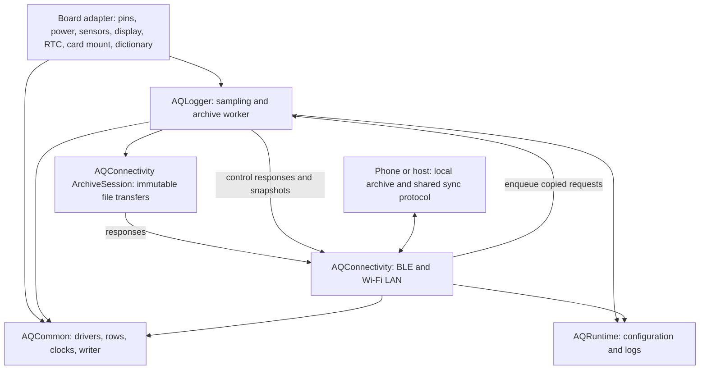

# Reusable firmware modules

The common tree contains a base Arduino library, **AQCommon**, and three opt-in libraries: **AQRuntime**, **AQConnectivity** and **AQLogger**. Keeping settings/logging separate avoids charging a UART-only diagnostic for the log ring or radio stack. AQLogger adds the shared logger worker only when a board opts in. Pure framing/encoding/math code and the actual status/provisioning helpers are also host-testable. The current target is Arduino-ESP32 on ESP32-S3; this does not promise another SDK or MCU is integrated.

| Module | Shared responsibility | Consumer supplies |
| --- | --- | --- |
| `src/pms_frame.*` | Plantower byte framing, checksum, model-specific decoding | UART, selected sensor model, freshness/warm-up policy |
| `src/aq_ltr553.h` | LTR553 register setup and raw validity | Existing bus read/write and timing callbacks |
| `src/numeric_sample.h` | Fixed-size numeric rows with explicit validity/nulls | Board field dictionary and collection |
| `src/utc_clock.h` | UTC anchor arithmetic, source codes, calendar conversion and supported bounds | Coherent anchor locking, host sync and optional RTC adapter |
| `src/parquet_writer.*`, `lz4_codec.*` | Bounded Parquet encoding and pinned LZ4 | Columns, provenance, memory, file sink and rotation policy |
| `src/sync_codec.h` | Little-endian frames, CRC32, safe relative names, structural file completion | Checked buffers, mount roots and reader conformance checks |
| `runtime/src/device_config.*` | NVS pairing/Wi-Fi/LAN settings, tokens and CONFIG JSON | First-boot display capability; command execution and owner access to pairing PIN |
| `runtime/src/debug_log.*` | Bounded diagnostic ring and console forwarding | Optional `Print` sink, configured before tasks start |
| `connectivity/src/ble_sync.*` | Secure GATT pairing, advertising, framing and notifications | Stable identity, nonblocking request-queue handler, status/live snapshots |
| `connectivity/src/wifi_link.*` | Wi-Fi station/provisioning, scans, mDNS, token-authenticated TCP | Stable identity, same request handler and configuration |
| `connectivity/src/control_sync.*` | Configuration, BLE-only token and bounded log-tail commands | Worker-side response adapters |
| `connectivity/src/sync_service.*` | Configuration and transport startup | Storage queue ready, identity and display capability |
| `connectivity/src/archive_sync.*` | Immutable file LIST/OPEN/READ/CLOSE sessions, offsets and link generations | Archive enumeration/path/finalization callbacks, worker bus lock and response adapters |
| `logger/src/aq_logger.*` | Ten-second sampling deadline, single worker, station identity, clock anchors, PSRAM batching, Hive paths, immutable archive lifecycle and serial/link snapshots | Static board dictionary/provenance, acquisition callback, already mounted filesystem, capacity and optional bus/RTC callbacks |
| `logger/src/aq_logger_status.*` | Pure bounded STATUS formatting | Coherent runtime snapshot |
| `logger/src/aq_logger_provision.*` | Physical UART profile encoding and local SET_CONFIG reply capture | Physical serial owner access; host handling that excludes credentials from captures |



## Consumption

```sh
# Base modules only, including the retained Waveshare UART/TF diagnostic.
arduino-cli compile --library firmware/common ...
# Shared logger with a board-owned schema and hardware adapter.
arduino-cli compile --library firmware/common --library firmware/common/runtime --library firmware/common/connectivity --library firmware/common/logger ...
```

Call `aqlogger::begin(config, hooks, sd_mounted)` once after board setup, then
`start_links(display_detected)` and `poll()` on the main loop. Stable descriptors
and callback contexts must outlive the runtime. The board collector fills only
hardware fields; the engine maps standard clock/identity/counter fields by name,
sets matching types only, and leaves absent or unavailable measurements null.
Capacity callbacks borrow the board's mounted filesystem. Bus callbacks are a
pair; otherwise the engine owns its mutex. RTC callbacks run only on the main
task, including writes requested by worker-side host synchronization.

BLE and LAN copy requests into the worker queue without touching the card or
display. Startup enumeration emits a bounded count/partial summary rather than dumping
archive paths to USB; explicit `parquet list` retains its full serial protocol.
The worker owns filesystem access after startup, rotation, row-group
sync, finalization and preserved-partial quarantine. It invokes the shared
ArchiveSession and common configuration handlers. No mount, format, retention
delete or cloud upload is introduced. The card remains the data origin and the
phone/laptop archive its first copy. Finalized files are immutable; each completed
row group is fsynced, but unfinished RAM rows can be lost and power-cut durability
requires board measurements.

Both current board logger adapters consume AQLogger. CoreS3 retains M5Unified,
its 77-column dictionary, SPI/display arbitration and optional BM8563 hooks.
Waveshare supplies its 49-column PMS5003T dictionary and one-bit SDMMC adapter,
with no RTC hook in this image. Its retained diagnostic remains a base-only
consumer. Source integration does not transfer hardware measurements between
boards; use each board's bench record for the deployed image and tested scope.

STATUS/LIVE JSON allows 480 bytes while BLE frames remain capped at 512. MTU 483
can carry the largest JSON value in one notification. Publishers always cache
the complete value and omit notifications exceeding negotiated MTU − 3; clients
use characteristic long reads for complete cached snapshots. The host STATUS
boundary test retains every key at 398 bytes even with the widest numeric values.
LIVE `t` is board-specific (CoreS3 IMU temperature or Waveshare PMS5003T ambient
temperature); `rh` is Waveshare ambient RH. Absent keys are null. Without an RTC,
`rtc=2`, `clk=0` and UTC stays null until host SET_TIME, including after reboot.

Physical serial owner/provisioning commands are documented in [AQLogger](logger/README.md).
Their PIN/profile replies bypass the log ring and radio interfaces; host tooling
must consume credentials in memory and exclude them from retained captures.

Verification commands: `pixi run common-test`, `ltr553-test`, `config-test`,
`control-sync-test`, `archive-sync-test`, `pms-frame-test`, `parquet-test --sanitize`,
`telemetry-contract-test --sanitize`, `waveshare-contract-test --sanitize`,
`connectivity-build-test`, `logger-build-test`, `logger-status-test`,
`logger-provision-test`, and affected board builds. Generic compile fixtures
have no M5 dependency and are never flashed. Host fixtures establish logic and
format boundaries, not real radio behavior, NVS atomicity or SD durability.

### Verification on 2026-09-28

The pre-AQLogger gates, formatting, cppcheck and host BLE/LAN protocol tests passed for the historical builds below. The host module tests use AddressSanitizer and UndefinedBehaviorSanitizer; Parquet/measurement fixtures also passed both readers.

| Compiled consumer | Program bytes | Static RAM bytes |
| --- | ---: | ---: |
| CoreS3 source v6.4 | 1,422,279 | 86,036 |
| Generic ESP32-S3 connectivity fixture | 1,082,380 | 63,976 |
| Waveshare diagnostic (base library only) | 353,853 | 22,288 |

The retained Waveshare diagnostic produced the UART/TF observations in its [bench record](../../docs/boards/waveshare-esp32-s3-sim7670g/bench-verified.md). The historical CoreS3 v6.4 build was subsequently flashed and passed a [short hardware test](../../docs/boards/m5stack-cores3/bench-verified.md#board-1-shared-esp32-s3-modules-firmware-v64), including identical BLE/LAN Parquet readback. This does not extend the earlier full-window/endurance measurements to the extracted image.

### AQLogger host/compile verification on 2026-09-28

The generic ESP32-S3 logger fixture compiled with all four libraries and no
M5Unified/M5GFX dependency: 1,139,806 program bytes and 83,500 static RAM bytes.
ASan/UBSan checked the actual STATUS formatter (398/393 bytes for the two codecs,
including numeric maxima and truncation boundaries), and actual SET_CONFIG
validators/actions behind UART provisioning (UTF-8 hex round trips, malformed
inputs, command bounds and diagnostic-ring secrecy). These are source/host gates;
board tests and their image identities belong to the board bench records.
