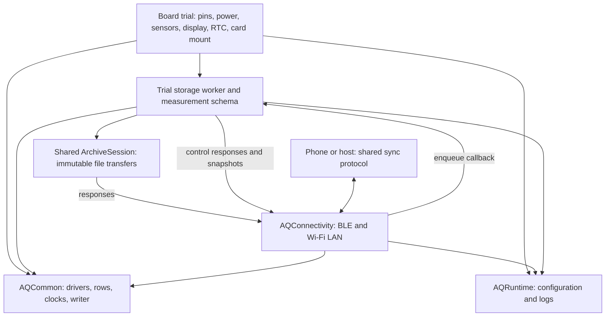

# Reusable firmware modules

The common tree contains a base Arduino library, **AQCommon**, and opt-in **AQRuntime** and **AQConnectivity** libraries. Keeping settings/logging separate avoids charging a UART-only diagnostic for the log ring or radio stack. Pure framing/encoding/math code is also host-testable. The current target is Arduino-ESP32 on ESP32-S3; this does not promise another SDK or MCU is integrated.

| Module | Shared responsibility | Consumer supplies |
| --- | --- | --- |
| `src/pms_frame.*` | Plantower byte framing, checksum, model-specific decoding | UART, selected sensor model, freshness/warm-up policy |
| `src/aq_ltr553.h` | LTR553 register setup and raw validity | Existing bus read/write and timing callbacks |
| `src/numeric_sample.h` | Fixed-size numeric rows with explicit validity/nulls | Board field dictionary and collection |
| `src/utc_clock.h` | UTC anchor arithmetic, source codes, calendar conversion and supported bounds | Coherent anchor locking, host sync and optional RTC adapter |
| `src/parquet_writer.*`, `lz4_codec.*` | Bounded Parquet encoding and pinned LZ4 | Columns, provenance, memory, file sink and rotation policy |
| `src/sync_codec.h` | Little-endian frames, CRC32, safe relative names, structural file completion | Checked buffers, mount roots and reader conformance checks |
| `runtime/src/device_config.*` | NVS pairing/Wi-Fi/LAN settings, tokens and CONFIG JSON | First-boot display capability; command execution and owner access to pairing PIN |
| `runtime/src/debug_log.*` | Bounded diagnostic ring and console forwarding | Optional `Print` sink, configured before tasks start |
| `connectivity/src/ble_sync.*` | Secure GATT pairing, advertising, framing and notifications | Stable identity, nonblocking request-queue handler, status/live snapshots |
| `connectivity/src/wifi_link.*` | Wi-Fi station/provisioning, scans, mDNS, token-authenticated TCP | Stable identity, same request handler and configuration |
| `connectivity/src/control_sync.*` | Configuration, BLE-only token and bounded log-tail commands | Worker-side response adapters |
| `connectivity/src/sync_service.*` | Configuration and transport startup | Storage queue ready, identity and display capability |
| `connectivity/src/archive_sync.*` | Immutable file LIST/OPEN/READ/CLOSE sessions, offsets and link generations | Archive enumeration/path/finalization callbacks, worker bus lock and response adapters |



## Consumption

```sh
# Base modules only (the Waveshare UART/TF diagnostic).
arduino-cli compile --library firmware/common ...
# A logger/runtime that implements the sync backend (currently CoreS3).
arduino-cli compile --library firmware/common --library firmware/common/runtime --library firmware/common/connectivity ...
```

`aqsync::begin(identity, enqueue_handler, display_detected)` starts the shared transports after the worker queue is ready. BLE and LAN call the handler concurrently; it must copy/enqueue and return promptly, without touching the card or display. Identities and callback contexts must outlive the services. The worker performs storage/control operations and answers on the originating link. Radio settings, NVS namespaces, UUIDs, frame limits and wire protocol are preserved by the extraction.

The CoreS3 adapter still owns M5Unified hardware access, BM8563 RTC synchronization, its 77-column schema, collection, SPI/display arbitration and storage rotation/quarantine policy. Waveshare currently consumes the base parser and boots a UART/TF diagnostic; sharing the radio code does **not** enable full sync on that diagnostic. Its logger/backend and real radio/file-transfer validation are later integration work.

Verification commands: `pixi run common-test`, `pixi run ltr553-test`, `pixi run config-test`, `pixi run control-sync-test`, `pixi run archive-sync-test`, `pixi run pms-frame-test`, `pixi run parquet-test --sanitize`, `pixi run telemetry-contract-test --sanitize`, `pixi run connectivity-build-test`, and the affected board builds. The connectivity fixture compiles for a generic ESP32-S3 with no M5Unified dependency and is never flashed.

### Verification on 2026-09-28

All gates above, formatting, cppcheck and the host BLE/LAN protocol tests passed. The host module tests use AddressSanitizer and UndefinedBehaviorSanitizer; Parquet/measurement fixtures also passed both readers.

| Compiled consumer | Program bytes | Static RAM bytes |
| --- | ---: | ---: |
| CoreS3 source v6.4 | 1,422,279 | 86,036 |
| Generic ESP32-S3 connectivity fixture | 1,082,380 | 63,976 |
| Waveshare diagnostic (base library only) | 353,853 | 22,288 |

These are build results. The retained Waveshare diagnostic produced the UART/TF observations in its [bench record](../../docs/boards/waveshare-esp32-s3-sim7670g/bench-verified.md); these builds were not flashed, and the extracted connectivity stack has not received a new hardware validation run.
